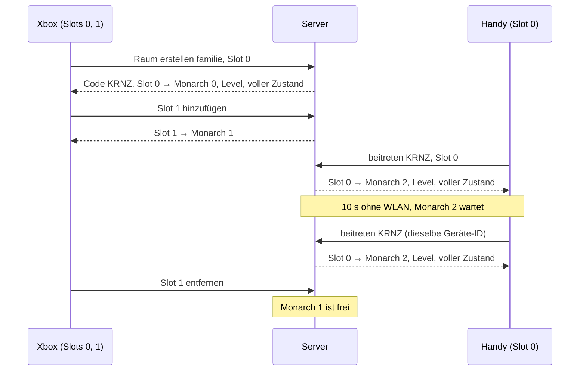

# Protokoll v6

**Änderungen gegenüber v5 (K4, Version 6, B-154, B-345):** `snap`/`delta` nennen Endboss-Phase und Warnkreis
(`enemies[].phase`, `enemies[].warn`), aktive Nacht-Events mit Restzeit (`nightEvents`) und den Wechselpunkt zur
nächsten Insel (`islandSwitch`); siehe *Kampf: Bosse, Events, Inselwechsel*. Wechselt der Raum die Insel, beginnt jeder
Strom des Geräts neu mit `level` und `snap` (kein `delta` über den Wechsel). Keine neuen Nachrichten, keine
Wechsel-Bestätigung: Der Wechsel entsteht durch Anwesenheit am Wechselpunkt. `hello.v` muss 6 sein; ein v5-Client
erhält `version`. Dev-Seite: Aktion `grade` (siehe *HTTP: Dungeon-Master-Seite*).

**Änderungen gegenüber v4 (W5, Version 5, B-153, B-283):** `snap`/`delta` nennen den Wirtschaftsstand (`stockMax`, `hubLevel`, `hubUpgrade`, `danger`, `merchant`, `drops`, Berufe der Bürger; siehe *Wirtschaft: Hub, Lager, Wartegrund, Händler*) und die Ereignisse `revived`, `disarmed`, `equipmentTaken`. Keine neuen Nachrichten: Hub-Ausbau, Tausch beim Händler und Berufswahl bleiben Bezahlen am Ort über `input.pay` (B-330). `hello.v` muss 5 sein; ein v4-Client erhält `version`. Nachgetragen ohne neue Version (W10.2, B-332): `fighters` und `troopLimit` im Zustand, Zusatzfelder wie `playerDown.cause`.

**Änderungen in v4 (S2.4, B-176):** Ein Gerät bekommt Level und Zustand **jeder** Stufe, in der einer seiner Slots
steht, je Stufe ein eigener Strom. `level`, `snap` und `delta` tragen auf oberster Ebene `stage` (Index der Stufe auf
der Insel, 0…n−1, Schlüssel des Stroms); `you[]` in `joined` und `seats` nennt je Platz `stage`. `depth` bleibt in
`level`, `s` und `you[]`. Regeln: *Mehrere Stufen je Gerät*. Die Version bleibt 4: S2.1 und S2.4 erhöhen sie gemeinsam
einmal (kein Release dazwischen, ein v4-Client ohne `stage` wurde nie ausgeliefert).

**Änderungen gegenüber v3 (S2.1, Version 4, B-123):** `input.p[]` nimmt `attack` (gehalten = Schlag) und `skill`
(Skill-Slot 1–4, 0 = keiner); neue Nachrichten `learn` und `respec`. Jeder Spieler in `players[]` von `snap`/`delta`
nennt `skills`, `slots`, `cooldowns`, `attackCooldown` (fehlen, solange leer bzw. 0), dazu immer `points` und
`actions` (siehe *Skills und Aktionen*). `hello.v` muss 4 sein; ein v3-Client erhält `version`.

**Änderungen gegenüber v2 (SP14.2, Version 3):** `you[]` in `joined` und `seats` nennt je Platz die `depth` (Tiefe der Stufe
des Monarchen, denn jedes Gerät sieht die Stufe seines ersten Monarchen und Spieler anderer Stufen fehlen im Zustand: der
Client sucht Spieler nach `index`, nicht nach Position). `create` nimmt die optionalen Strings `grade`
(`dev|easy|normal|hard|ultra`), `goal` (`endboss|gold|days|mineAll|buildAll`) und `defeat` (`resources|stage|lost`); fehlend
heißt Standard. Der Server prüft sie beim Anlegen eines neuen Stands (SP14.3): Fehlende Felder bekommen den Standard (Grad: `dev` im
Dev-Mode, sonst `normal`; `goal`/`defeat` je Grad), ein unbekannter Wert oder `dev` ohne Dev-Mode (`K3C_DEV=0`) ergibt
`bad_request`. Die Optionen stehen im Spielstand; für einen vorhandenen Stand (`fresh` false) werden sie ignoriert, ein
gespeicherter Grad `dev` wird im Live-Modus beim Laden auf `normal` gesetzt. `rooms[]`
nennt zusätzlich den `grade` des Raums. In v3 musste `hello.v` 3 sein.

Stand: 2026-09-30 · Sprint SP02 · [Entscheidung 002](decisions/002-protokoll-v2.md) · Zielbild: [Entscheidung 001](decisions/001-server-engine-go.md)

## Überblick

Der Go-Server rechnet alle Spiele. Jedes Spiel läuft in einem **Raum**. Browser sind reine Clients: Sie schicken die
Eingaben ihrer lokalen Spieler und zeichnen, was der Server schickt. Ein Gerät kann mehrere lokale Spieler haben
(Couch-Koop an der Xbox), mehrere Geräte teilen sich einen Raum (Online-Koop im Heimnetz), und mehrere Räume laufen
gleichzeitig.

Dieses Dokument legt das Raummodell fest. Es setzt die Beschlüsse von 🧑 vom 2026-09-30 um (Sprint-README SP02 ›
Regeln, Nummern 1–4 unten in Klammern). Protokoll v1 (`src/online/`) läuft unverändert weiter, bis SP07/SP08 v2 umsetzen.

## Begriffe

| Begriff | Bedeutung |
|---|---|
| **Raum** | Ein laufendes Spiel: eine Welt (Kampagne mit allen Stufen), ein Spielstand, ein Code. Tickt unabhängig von anderen Räumen. |
| **Code** | Kurze Kennung eines Raums: 4 Großbuchstaben ohne `I` und `O` (z. B. `KRNZ`). Vergibt der Server beim Erstellen, eindeutig solange der Raum lebt. |
| **Gerät** | Ein Browser mit Verbindung zum Server. Hat eine dauerhafte **Geräte-ID** (zufällig erzeugt, im `localStorage` gespeichert, deshalb gleich für alle Tabs desselben Browsers), damit es sich nach einem Abbruch wiedererkennen lässt. |
| **lokaler Spieler** | Ein Spieler an einem Gerät mit eigener Eingabe (Controller, Tastatur, Touch). Heißt auf dem Gerät **Slot** 0–3. |
| **Monarch** | Die Figur eines Spielers in der Welt, Index 0–3. Ein Monarch ist **besetzt** (gehört genau einem Paar Gerät + Slot), **wartend** (sein Gerät ist abgebrochen, höchstens 60 s) oder **frei**. |
| **Spielstand** | Gespeicherter Zustand einer Kampagne unter einem Namen (heute `saves/<name>.json`). Ein Raum ist genau ein Spielstand. |

Ein wartender oder freier Monarch bleibt in der Welt stehen und behält Münzen und Besitz. Er bewegt sich nicht.
Für den **Stufenwechsel** zählen nur besetzte Monarchen: Stehen alle besetzten am Ausgang, reisen freie und wartende
mit (Entscheidung 🧑 2026-09-30, Umsetzung B-059).

## Raumliste und Code

(Beschluss 1) Der Server liefert jedem verbundenen Gerät eine **Raumliste**, im Heimnetz ist nichts geheim.
Je Raum: Code, Name, Stufe, besetzte und freie Plätze, ob er gerade läuft oder pausiert. Die Liste ändert sich,
wenn ein Raum entsteht, verschwindet oder ein Platz sich ändert; Geräte ohne Raum bekommen die neue Liste geschickt.

Zusätzlich kann ein Gerät einem Raum **direkt per Code** beitreten, z. B. über einen Link mit dem Code in der URL
(Parameter legt SP08 fest). Der **Name** eines Raums ist der Name seines Spielstands.

## Beitreten

**Raum erstellen:** Jedes Gerät darf einen Raum erstellen. Es wählt einen neuen Spielstand (Name, Startstufe) oder
einen gespeicherten. Der Name passt zu `^[a-z0-9-]{1,32}$` (wie heute `server/saves.mjs`). Der Server prüft in dieser
Reihenfolge und hört beim ersten Treffer auf:

1. Ein Slot 4 oder höher → `too_many_slots`; sonst ungültige Nachricht, Name oder Slots → `bad_request`.
2. Der Spielstand ist schon in einem Raum offen: bei *gespeichert* wird diesem Raum beigetreten (ein Spielstand läuft
   nie doppelt), bei *neu* `save_exists`.
3. *Neu*, aber unter dem Namen liegt schon ein Spielstand → `save_exists`. *Gespeichert*, aber es gibt keinen →
   `save_not_found`.
4. Es sind schon 4 Räume offen → `too_many_rooms`.
5. Der Server erstellt den Raum, vergibt den Code und schickt ihn mit.

**Raum beitreten** (aus der Liste oder per Code):

1. Das Gerät nennt Geräte-ID, Code und die Slots seiner lokalen Spieler (mindestens einer).
2. Der Server prüft die Grenzen (siehe *Grenzen*). Passt es nicht, antwortet er mit einem Fehler und nimmt keinen
   Slot auf (alles oder nichts).
3. Jeder Slot bekommt einen Monarchen: zuerst einen freien, dabei bevorzugt den, den dasselbe Gerät mit demselben
   Slot zuletzt hatte, sonst den mit dem kleinsten Index; gibt es keinen freien, entsteht ein neuer.
4. Der Server schickt die Zuordnung Slot → Monarch, das Level und einen vollen Zustand. Danach laufende Zustände.

Ein Raum ohne verbundenes Gerät ist **pausiert**: Die Welt tickt nicht. Sobald ein Gerät beitritt, läuft sie weiter.

## Lokale Spieler hinzufügen/entfernen

Ein Gerät im Raum kann jederzeit einen Slot **hinzufügen** (z. B. zweiter Controller drückt A). Der Slot bekommt einen
Monarchen nach Schritt 3 oben, sofern die Grenzen es erlauben. Einen Slot **entfernen** macht dessen Monarchen sofort
frei; die anderen Slots desselben Geräts bleiben unberührt. Entfernt ein Gerät seinen letzten Slot, verlässt es den
Raum (siehe unten).

## Verlassen und Abbruch

- **Verlassen** (bewusst, z. B. Home-Button): Alle Monarchen des Geräts werden **sofort frei**.
- **Abbruch** (Verbindung weg, ohne Abmeldung): (Beschluss 3) Die Monarchen des Geräts werden **wartend** und stehen
  still. Nach **60 s** ohne Rückkehr werden sie frei.
- Ist danach kein Gerät mehr verbunden, ist der Raum pausiert und leer. Der Raum speichert sofort (siehe
  *Spielstand*). Bleibt er **10 min** leer, speichert er erneut und wird aufgeräumt; sein Code wird frei.

Beide Fristen (60 s, 10 min) laufen nach der Wanduhr des Servers, auch während der Raum pausiert ist.

## Wiederverbinden

(Beschluss 3) Ein Gerät, das nach einem Abbruch mit derselben Geräte-ID und demselben Code zurückkommt:

- **binnen 60 s:** Jeder genannte Slot bekommt den Monarchen zurück, den (Gerät, Slot) zuletzt hatte, und steuert
  weiter. Monarchen von Slots, die das Gerät nicht mehr nennt, werden sofort frei; zusätzliche Slots werden wie beim
  Hinzufügen behandelt. Der Server schickt Zuordnung, Level und einen vollen Zustand wie beim Beitreten.
- **nach 60 s:** Seine Plätze sind frei. Es tritt ganz normal neu bei. Weil beim Beitreten der Monarch bevorzugt wird,
  den (Gerät, Slot) zuletzt hatte, bekommt es seine alten Monarchen zurück, sofern kein anderes Gerät sie inzwischen
  übernommen hat.
- **nach dem Aufräumen:** Der Code ist unbekannt (Fehler). Der Spielstand ist gespeichert, das Gerät kann ihn über
  *Raum erstellen* wieder öffnen.

Tritt eine Geräte-ID einem Raum bei, in dem sie noch als verbunden gilt (z. B. zweiter Tab im selben Browser oder die
alte Verbindung ist noch nicht als abgebrochen erkannt), ersetzt die neue Verbindung die alte: Die alte bekommt den
Fehler `replaced` und wird geschlossen. Ein Gerät, das `replaced` bekommt, verbindet sich **nicht** automatisch neu,
sonst verdrängen sich zwei Tabs gegenseitig.

## Grenzen

(Beschluss 2) Der Server setzt durch:

| Grenze | Wert | Folge |
|---|---|---|
| Monarchen pro Raum | 4 | Ein Raum hat höchstens 4 Monarchen (besetzt, wartend oder frei) und damit höchstens 4 Geräte. |
| lokale Spieler pro Gerät | 4 | Slots 0–3. |
| Räume pro Server | 4 | Ein fünfter Raum wird nicht erstellt. |

Die Grenzen passen zum Raspberry Pi (SP11) und zur Snapshot-Schätzung für 4 Spieler (SP02.2). Heute (v1) sind es
8 Spieler pro Raum und keine Raum-Grenze.

## Spielstand

(Beschluss 4) Ein Raum ist genau ein Spielstand, ein Spielstand ist höchstens in einem Raum offen. Der Raum speichert
selbst, ohne Zutun der Geräte:

- bei jedem Stufenwechsel (Tiefen-Eingang, Treppe),
- bei jedem Verlassen und Abbruch eines Geräts, auch wenn andere Geräte bleiben (B-147); beim letzten ist der Raum
  danach leer und pausiert,
- beim Aufräumen nach 10 min Leere,
- beim geordneten Beenden des Servers.

Ein Schreibfehler steht im Log (`💥 Spielstand nicht gespeichert`), der vorige Stand bleibt unverändert (atomares
Schreiben, `engine/store`), der Raum läuft weiter. Jede Speicherung loggt ihre Dauer (`ms`); über einem Tick (33 ms)
als Warnung. Ein Autospeicher-Takt und Speichern bei Tagesanbruch gibt es nicht (B-186).

Der Stand (Version 4, `engine/sim/island_save.go`) nennt neben der Welt `savedAt` (Zeitpunkt, ISO 8601), `day` (Tag)
und `phase` (`day`, `dusk`, `night`) beim Speichern sowie je Spieler die Tiefe seiner Stufe (`players[].depth`). `day`
und `phase` dienen nur der Anzeige; beim Laden gilt `time`. Ein Stand der Version 3 ohne die beiden Felder lädt weiter.

Ein Spielstand speichert die Welt, nicht die Monarchen und nicht die Zuordnung zu Geräten. Ein geöffneter Stand hat
zunächst **keinen** Monarchen; jeder entsteht beim Beitreten (Schritt 3). Gold gilt pro Index: Monarch n startet mit
dem gespeicherten Gold von Index n (wie heute `players[].gold` in `src/world/sim/campaign.ts`).

## Beispiel: 2 Controller an der Xbox + 1 Handy

1. Die Xbox (Gerät X) zeigt die Raumliste (leer) und erstellt einen Raum mit neuem Spielstand `familie`. Der Server
   vergibt Code `KRNZ`. Slot 0 (Controller 1) bekommt Monarch 0.
2. Controller 2 an der Xbox drückt A: X fügt Slot 1 hinzu → Monarch 1. Die Xbox zeigt Split-Screen.
3. Das Handy (Gerät H) sieht `KRNZ` `familie` mit 2 besetzten Plätzen in der Liste (oder öffnet den Link mit dem Code)
   und tritt mit Slot 0 bei → Monarch 2.
4. Das Handy verliert 10 s WLAN: Monarch 2 wird wartend und steht still, Xbox spielt weiter. H verbindet sich mit
   derselben Geräte-ID neu, bekommt Monarch 2 zurück und einen vollen Zustand.
5. Controller 2 verlässt das Spiel: X entfernt Slot 1, Monarch 1 wird frei und bleibt stehen. Slot 0 der Xbox und das
   Handy spielen weiter. Ein weiteres Gerät könnte jetzt beitreten und bekäme Monarch 1.



## Fehlerfälle

| Situation | Verhalten |
|---|---|
| Raum hat schon 4 Monarchen, keiner frei, Gerät will beitreten oder einen Slot hinzufügen | Fehler „Raum ist voll“, nichts wird aufgenommen; beim Beitreten bleibt das Gerät bei der Raumliste. |
| Gerät will einen 5. lokalen Spieler | Fehler „zu viele Spieler an diesem Gerät“, die bisherigen Slots bleiben. |
| Gerät will einen 5. Raum erstellen | Fehler „zu viele Räume“, das Gerät bleibt bei der Raumliste. |
| Unbekannter Code (nie vergeben oder aufgeräumt) | Fehler „Raum nicht gefunden“, das Gerät bleibt bei der Raumliste. |
| Neuer Spielstand unter einem Namen, den es schon gibt (gespeichert oder in einem Raum offen) | Fehler „Spielstand gibt es schon“, das Gerät bleibt bei der Raumliste. |
| Gespeicherter Spielstand, den es nicht gibt | Fehler „Spielstand nicht gefunden“, das Gerät bleibt bei der Raumliste. |
| Raum stürzt ab oder der Server fährt herunter | Fehler „Raum ist geschlossen“ an alle Geräte im Raum; sie gehen zurück zur Raumliste (beim Herunterfahren schließt der Server danach die Verbindung). |
| Dieselbe Geräte-ID tritt demselben Raum über eine neue Verbindung bei | Die alte Verbindung bekommt „an anderer Stelle geöffnet“ und wird geschlossen, kein automatisches Neuverbinden (siehe *Wiederverbinden*). |
| Gerät kommt nach mehr als 60 s zurück | Kein Fehler: normales Beitreten, freie Monarchen desselben Geräts zuerst (siehe *Wiederverbinden*). |
| Falsche Protokoll-Version oder erste Nachricht ist kein gültiges `hello` | Fehler „veraltete Version, Seite neu laden“, der Server schließt die Verbindung. |

Fehler beenden nie einen Raum und betreffen nie andere Räume; außer `room_closed` betreffen sie nur das eine Gerät.

## Nachrichten

**Transport:** JSON-Texte über WebSocket unter `/ws`, eine Nachricht pro Frame, Feld `t` = Typ. WebSocket liefert
vollständig und in Reihenfolge, deshalb braucht es keine Wiederholung und keine Lückenerkennung.

**Version:** Das Feld `v` steht nur im Handschlag (`hello`, `welcome`), nicht in jeder Nachricht. Die Version gilt für
die ganze Verbindung; jede weitere Nachricht damit auszustatten kostet bei 30 Snapshots pro Sekunde nur Bytes.
Erste Nachricht nach dem Verbinden ist immer `hello`. Ist sie kein gültiges `hello` (kein JSON, anderer Typ, Feld
fehlt, `v` nicht 5), antwortet der Server mit `version` und schließt: Ein alter v1-Client schickt zuerst `join`, ein
v4-Client schickt `v: 4`.

**Takt:** Ein laufender Raum tickt mit **30 Hz** und schickt jedem seiner Geräte pro Tick und Stufe des Geräts höchstens
einen Zustand (`snap` oder `delta`, Stufen aufsteigend). Ein pausierter Raum schickt nichts. Geräte schicken `input`
sofort, sobald sich die Eingabe eines Slots ändert (im Client mindestens 8 ms Abstand, `INPUT_MIN_GAP_MS`, also bis zu
einer je Bild), und sonst mindestens alle 500 ms zur Bestätigung. Der Server rechnet mit der zuletzt empfangenen Eingabe
und begrenzt die Rate nicht (B-279).

**Langsame Geräte (B-278):** Kommt ein Gerät mit dem Lesen nicht nach, ersetzt der Server einen noch nicht gesendeten
Zustand durch den neueren **derselben Stufe**: `tick` darf springen, und `events` des neuen Zustands enthält die
Ereignisse der übersprungenen Ticks dieser Stufe (höchstens 256, die ältesten fallen weg). Ein `delta` gilt immer
relativ zum **zuletzt an dieses Gerät gesendeten** Zustand seiner Stufe, nicht zum Zustand des vorigen Ticks. `ack` ist
das höchste `seq`, das im gesendeten Zustand verrechnet ist. Getrennt wird erst, wenn sich 64 andere Nachrichten stauen;
das zählt als Abbruch.

| Nachricht | Richtung | Wann | Felder | Beispiel |
|---|---|---|---|---|
| `hello` | Gerät → Server | als erste Nachricht | `v` Protokoll-Version (5), `device` Geräte-ID (≤ 64 Zeichen) | `c2s-hello.json` |
| `welcome` | Server → Gerät | Antwort auf passendes `hello` | `v`, `tickHz`, `limits` (Grenzen aus *Grenzen*) | `s2c-welcome.json` |
| `rooms` | Server → Gerät | nach `welcome`, sobald das Gerät wieder in keinem Raum ist, und bei jeder Änderung, solange es in keinem Raum ist | `rooms[]`: `code`, `name`, `depth`, `grade`, `taken` (besetzt + wartend), `free` (4 − `taken`), `running` | `s2c-rooms.json` |
| `create` | Gerät → Server | Raum erstellen | `save` Name des Spielstands (`^[a-z0-9-]{1,32}$`), `fresh` neu (true) oder gespeicherten laden, `depth` Startstufe (nur bei `fresh`), `slots[]`, optional `grade`, `goal`, `defeat` (siehe oben) | `c2s-create.json` |
| `join` | Gerät → Server | Raum beitreten oder wiederverbinden | `room` Code, `slots[]` | `c2s-join.json` |
| `joined` | Server → Gerät | nach erfolgreichem `create`/`join` | `room`, `name`, `you[]`: `slot` → `monarch`, `depth`, `stage` | `s2c-joined.json` |
| `level` | Server → Gerät | nach `joined` und sobald eine Stufe für das Gerät neu ist, vor dem ersten Zustand der Stufe | `stage`, `depth`, `layout` (Level: Biom-ID, Breite, Chunks, Objekte) | `s2c-level.json` |
| `snap` | Server → Gerät | voller Zustand einer Stufe: nach ihrem `level` (Beitreten, Wiederverbinden, Stufenwechsel) | `stage`, `tick`, `ack`, `s` (Zustand der Welt ohne Statisches, mit `events` und `depth`) | `s2c-snapshot-full.json`, `s2c-snapshot-wirtschaft.json`, `s2c-snapshot-boss.json`, `s2c-snapshot-event.json` |
| `delta` | Server → Gerät | jeder weitere Tick, je Stufe | `stage`, `tick`, `ack`, `s` (nur Änderungen zum zuletzt gesendeten Zustand dieser Stufe) | `s2c-snapshot-delta.json` |
| `seats` | Server → alle Geräte im Raum | wenn sich eine Zuordnung, ein Monarch-Zustand oder eine Stufe ändert | `you[]` (eigene Slots mit `monarch`, `depth` und `stage`), `monarchs[]` je Index `taken`/`waiting`/`free` | `s2c-seats.json` |
| `addSlot` | Gerät → Server | lokaler Spieler kommt dazu | `slot` 0–3 | `c2s-add-slot.json` |
| `removeSlot` | Gerät → Server | lokaler Spieler geht | `slot` | `c2s-remove-slot.json` |
| `input` | Gerät → Server | Eingabe hat sich geändert, sonst mindestens alle 500 ms, höchstens eine pro Tick | `seq` fortlaufend je Verbindung, `p[]`: `slot`, `moveX` (−1…1), `sprint`, `pay`, `attack` (fehlt = false), `skill` (0–4, fehlt = 0) | `c2s-input.json` |
| `learn` | Gerät → Server | Skill lernen, im Raum | `slot` (vom Gerät), `skill` Skill-ID aus `data/monarch.json › skills` | `c2s-learn.json` |
| `respec` | Gerät → Server | Skill-Verteilung zurücksetzen, im Raum | `slot` (vom Gerät) | `c2s-respec.json` |
| `leave` | Gerät → Server | Raum bewusst verlassen | – | `c2s-leave.json` |
| `dev` | Gerät → Server | nur im Dev-Mode (siehe *Dev-Aktionen*), im Raum | `action` und je Aktion: `gold` `slot`, `amount`; `material` `slot`, `resource`, `amount`; `timescale` `factor`; `pause` `paused` | `c2s-dev-gold.json`, `c2s-dev-material.json`, `c2s-dev-timescale.json`, `c2s-dev-pause.json` |
| `error` | Server → Gerät | Fehlerfall, siehe Codes | `code`, `message` (deutsch, für die Anzeige) | `s2c-error.json`, `s2c-error-forbidden.json` |

Die Beispiele stammen aus dem Ablauf *2 Controller an der Xbox + 1 Handy*; `level`, `snap` und `delta` sind aus der
heutigen TS-Simulation erzeugt (Seed `familie`, 3 Spieler, Tick 299/300). **Außerhalb des Ablaufs:** der zweite Raum
`BWTQ` in `s2c-rooms.json` (zeigt einen pausierten Raum), `s2c-error.json` (`room_full` kommt im Ablauf nicht vor) sowie
`c2s-dev-*.json` und `s2c-error-forbidden.json` (Dev-Aktionen) sowie `s2c-snapshot-wirtschaft.json` (siehe *Wirtschaft*).

**Zustand und Delta:** `s` in `snap` hat die Felder der Welt ohne `seed`, `biome`, `level`, `rng`, `widthUnits`
(wie v1), dazu `events` des Ticks (leer: `[]`) und `depth`, die Stufe des Zustands (gleich `level.depth`).
`delta` enthält nur geänderte Felder; ein Feld, das fehlt, ist unverändert. Listen mit `id` (`players`, `coins`,
`troops`, `nodes`, `sites`, `enemies`, `projectiles`, `pickups`, `drops`) stehen als `{ "set": [geänderte oder neue Einträge],
"del": [entfernte ids] }`. Alles ohne `id` (einfache Werte, Objekte wie `cycle`, `castle`, `stock`, `travel`, Listen
wie `camps`, `portals`, `spawnQueue`) steht bei einer Änderung ganz darin. `null` ist ein Wert (z. B. `travel` endet),
kein Löschen. Felder, die im vorigen Zustand standen und jetzt fehlen (z. B. `merchant`, `drops`), nennt `delta` in
`unset` (Namen, sortiert, `events` nie); der Client entfernt sie. Fehlt keins, fehlt `unset`. Fehlt `events`, gab es im
Tick keine. `seq` zählt je Verbindung ab 1, nach einem Wiederverbinden also
neu. `ack` ist das höchste `seq`, das der Server von **dieser** Verbindung verrechnet hat (Grundlage für eine spätere
Vorhersage, B-039).

### Mehrere Stufen je Gerät

(S2.4, B-176) Ein Gerät bekommt einen Strom je Stufe, in der mindestens einer seiner Slots steht (`you[].stage`); ein
Gerät ohne Slots bekommt keinen. Stufen ohne eigenen Slot kommen nie an.

- **Reihenfolge:** je Tick und Stufe genau ein `snap` oder `delta`, Stufen aufsteigend nach `stage`. Je Stufe gilt
  `level` → `snap` → `delta` …; der Client hält Zustand und `delta` je `stage` getrennt und verwirft ein `delta` ohne
  `snap` seiner Stufe.
- **Neue Stufe:** Kommt ein Slot in eine Stufe, die das Gerät noch nicht hat, beginnt ihr Strom mit `level` und `snap`
  vor dem ersten `delta`.
- **Ende eines Stroms:** keine eigene Nachricht. Verlässt der letzte Slot des Geräts eine Stufe, kommen für sie keine
  Zustände mehr; `seats` (nach jedem Stufenwechsel gesendet) nennt die Stufen der Slots, der Client verwirft Ströme, die
  dort nicht mehr vorkommen. Kommt ein Slot zurück, beginnt der Strom wieder mit `level` und `snap`.
- **Wiederverbinden:** `level` und `snap` aller Stufen des Geräts, aufsteigend, danach `seats`.
- **Inselwechsel** (v6, B-345): Meldet die Sim `islandSwitch.ready`, tauscht der Raum im selben Tick die Insel. Geräte
  und Slots bleiben, alle Spieler stehen in Stufe 0 der neuen Insel; das Gerät bekommt `seats`, danach `level` und `snap`
  (kein `delta` über den Wechsel). Auf der letzten Insel gibt es keinen Wechsel.
- **Neue Slots** (`addSlot`, Beitreten) kommen in die Stufe des kleinsten Slots des Geräts.
- **Client heute:** `RoomClient.level` und `takeFrames()` liefern die Stufe des kleinsten eigenen Slots,
  `stages()`, `levelOf(stage)` und `takeFramesOf(stage)` die übrigen (Kamera je Stufe: B-106).

**Level-Übertragung:** Ab SP09 hat der Browser keinen Level-Generator mehr. Deshalb schickt der Server das Level
(`level`) statt nur den Seed. Biom-Werte (Farben, Namen) liest der Client aus `data/` über die Biom-ID.

### Skills und Aktionen

Schlag, Skills und Pool rechnet die Simulation (`engine/sim/monarch.go`, `skills.go`, Regeln `docs/rules/monarch.md`).
Eingaben sind **gehalten**: `attack` true schlägt, sobald der Schlag bereit ist (`attackCooldown` 0); `skill` n
(1–4) feuert den Skill in Slot n in jedem Tick, in dem er bereit ist. `skill` außerhalb 0–4 ist `bad_request`, die
ganze `input` wird verworfen (`ack` bleibt).

`learn` ruft das Lernen der Sim (ein Punkt je Skill, jeder Skill einmal, Tier-Gating; aktive Skills belegen den
ersten freien Slot), `respec` setzt Skills und Slots zurück (nur am Tag an der Burg). Erfolg hat keine eigene Antwort,
der nächste Zustand zeigt die Änderung; jede Ablehnung ist `bad_request`.

Felder je Spieler in `players[]` von `snap` und `delta`:

| Feld | Bedeutung | fehlt |
|---|---|---|
| `skills` | gelernte Skill-IDs in Lernreihenfolge | keine gelernt |
| `slots` | aktive Skills in Slot 1–4 (Index 0–3, `""` = frei) | keine belegt |
| `cooldowns` | Abklingzeit je Slot in Sekunden (Index wie `slots`) | alle 0 |
| `attackCooldown` | Sekunden bis zum nächsten Schlag | 0 |
| `points` | verfügbare Punkte: Pool der Insel (`skillPoints`) minus gelernte Skills, vom Server berechnet | nie |
| `actions` | gültige Aktionen am Ort des Spielers, vom Server berechnet, Liste (leer: `[]`) | nie |

`actions` nennt nur, was der Spieler **an seinem Ort** jetzt tun kann, in fester Reihenfolge: `{ "action": "attack" }`
(lebt, Schlag bereit), `{ "action": "skill", "slot": n, "skill": id }` je belegtem, bereitem Slot (lebt; `slot` wie
`input.p[].skill`), `{ "action": "learn" }` (`points` > 0). `respec` ist als Eintrag vorgesehen, fehlt aber, bis die
Sim eine Prüfung ohne Seiteneffekt bietet (B-270); die Nachricht `respec` wirkt trotzdem. Die Liste nennt keine Taste,
die Belegung gehört dem Client. Berufe, Tausch, Grabstein und Wiederbeleben kommen später (W5, B-120).

### Wirtschaft: Hub, Lager, Wartegrund, Händler

(W5.1, B-153) Die Simulation rechnet alle Werte (`engine/sim`, Regeln `docs/rules/materialien-gebaeude.md`,
`docs/rules/buerger.md`); der Zustand nennt Zahlen und Namen, keine Regeln und keine Texte. Ein Feld, das fehlt, heißt
„nicht vorhanden“ (kein Händler, kein Beruf, kein Ausbau); ein älterer Server sendet die Felder gar nicht, der Client
behandelt sie deshalb alle als optional. Im `delta` stehen sie wie jedes Feld ohne `id` bei einer Änderung ganz (außer
`drops`, Liste mit `id`); fehlt eins jetzt, steht es in `unset`. Mengen sind Stück, Gold sind Münzen.

Felder oben in `s` (`stockMax`, `hubLevel`, `hubUpgrade`, `danger`, `fighters`, `troopLimit` aus `sim.EconomyOf`, `engine/sim/economy_view.go`,
vom Server je Stufe abgelesen; die übrigen aus der Welt):

| Feld | Bedeutung | fehlt |
|---|---|---|
| `stock` | Vorrat der Insel je Rohstoff (`wood`, `stone`, `copper`, `iron`, `crystal`; Eisen und Kristall fehlen bei 0), alle Stufen gleich | nie |
| `stockMax` | Lager-Maximum je Rohstoff (ein Wert für alle) | ohne Insel (unbegrenzt) |
| `hubLevel` | Hub-Stufe 1 bis 5 | nie (älterer Server) |
| `hubUpgrade` | Ausbau auf die nächste Hub-Stufe: `gold` (Kosten), `material` (Kosten, Form wie `stock`), `paid` (bezahltes Gold), `state` (`waitingMaterial`, `waitingWorker`; fehlt, solange Gold offen ist) | auf Stufe 5 |
| `danger` | `true`: Nacht oder Gegner da, Bau und Ausbau warten | keine Gefahr |
| `fighters` | Zahl der Kämpfer der Stufe (für „Kämpfer/Limit“; W10.2, B-332) | nie (älterer Server); 0 ist ein Wert |
| `troopLimit` | Truppen-Limit der Stufe (Regel `docs/rules/buerger.md` § 3, zerstörte Kaserne zählt nicht) | nie (älterer Server) |
| `merchant` | anwesender Händler: `resource` (sein Material), `leaves` (Tag der Abreise), `buyPaid` (Gold des laufenden Kaufs, fehlt bei 0) | kein Händler (nur Tiefe 0) |
| `drops` | Ausrüstung am Boden, Liste mit `id`: `kind` (Figur oder Beruf), `x`, `workSite` (fehlt bei 0) | keine |
| `armorLevel` | Rüstungsstufe der Kämpfer des Hubs | 0 |

**Wartegrund je Bauplatz:** `sites[].state` (`unpaid`, `waitingMaterial`, `waitingWorker`, `built`) für den Bau,
`sites[].upgrade` (`waitingMaterial`, `waitingWorker`; fehlt ohne Ausbau oder solange Gold offen) mit `upgradePaid` und
`level` (fehlt = 1) für den Ausbau von Mauer und Turm, `hubUpgrade.state` für den Hub. `waitingWorker` heißt bei
`danger` „Gefahr“, sonst „kein Bauer“; den Text bildet der Client.

**Berufe:** `troops[].profession` (`miner`, `builder`, `craftsman`; fehlt = keiner) und `troops[].workSite` (Site-ID
des Arbeitsplatzes, fehlt = keiner). Berufswahl, Tausch und Hub-Ausbau als Eingabe stehen in W5.2.

Beispiel: `s2c-snapshot-wirtschaft.json` (Insel `w5-wirtschaft`, 3 Stufen, 4 Spieler, Stufe 0, Tick 408; Zustand aus
`wirtschaftsInsel` in `engine/net/wirtschaft_test.go`: Hub-Ausbau bezahlt und wartet auf Material, Lager gebaut und
gefüllt, Händler da, ein Bauer mit Beruf; die drei Ereignisse in `events` sind von Hand ergänzt, siehe *Ereignisse*).
Geprüft von `TestWirtschaftZustand`, `TestWirtschaftDelta`, `TestKaempferZustandUndDelta`, `TestWirtschaftBeispiel` und
`src/online/clientWirtschaft.test.ts`.

### Fehler-Codes

| Code | Situation (siehe *Fehlerfälle*) | Verbindung |
|---|---|---|
| `room_full` | Raum hat 4 Monarchen, keiner frei | bleibt |
| `too_many_slots` | 5. lokaler Spieler (Slot 4 oder höher bei `create`, `join`, `addSlot`) | bleibt |
| `too_many_rooms` | 5. Raum | bleibt |
| `room_not_found` | unbekannter Code | bleibt |
| `save_exists` | `create` mit `fresh: true` und einem Namen, den es schon gibt | bleibt |
| `save_not_found` | `create` mit `fresh: false` und einem Namen, den es nicht gibt | bleibt |
| `room_closed` | Raum abgestürzt oder Server fährt herunter; Gerät geht zurück zur Raumliste | bleibt (beim Herunterfahren: Server schließt) |
| `replaced` | dieselbe Geräte-ID ist demselben Raum über eine neue Verbindung beigetreten | Server schließt, kein automatisches Neuverbinden |
| `version` | erste Nachricht ist kein gültiges `hello` oder `v` ist nicht 5 | Server schließt |
| `forbidden` | `dev` ohne Dev-Mode am Server; die Warnung steht im Log | bleibt, Nachricht wird verworfen |
| `bad_request` | kein gültiges JSON, unbekannter Typ, Feld fehlt, Name passt nicht zum Format, ungültiger Slot (doppelt, keine Zahl 0–3, bei `input`/`removeSlot` nicht vom Gerät, bei `addSlot` schon vergeben), ungültige Felder von `dev`, ungültiger Skill-Slot (`input.p[].skill` nicht 0–4), unbekannter Skill, abgelehntes `learn`/`respec` (Slot nicht vom Gerät, Feld fehlt, schon gelernt, keine Punkte, Tier-Gating, Respec nicht am Tag oder nicht an der Burg), Nachricht passt nicht zum Zustand (`input`, `addSlot`, `removeSlot`, `leave`, `dev`, `learn`, `respec` ohne Raum; `create`, `join` im Raum) | bleibt, Nachricht wird verworfen |

`bad_request` ist kein Fehlerfall aus dem Raummodell, sondern Schutz vor kaputten Clients. Die Rückkehr nach 60 s ist
kein Fehler und hat keinen Code.

### Dev-Aktionen

`dev` gibt es nur im Dev-Mode des Servers (`K3C_DEV`, vor einem Release aus). Ohne Dev-Mode antwortet der Server
`forbidden`, noch bevor er die Felder prüft, und warnt im Log. Mit Dev-Mode prüft er die Verbindung und die Felder
(`amount` ganze Zahl 1…1000); Ungültiges ergibt `bad_request`. Ein älterer Server kennt `dev` nicht und antwortet
`bad_request`; die Protokollversion blieb damit 3. Jede gelungene Aktion steht als Info „Dev-Aktion“ im Log (Gerät,
Aktion, Werte, Raum).

- `gold`: `amount` Münzen fallen beim Monarchen des eigenen `slot` (an seinem `x`) und werden wie normale Münzen
  aufgehoben, solange der Beutel nicht voll ist; der Rest bleibt liegen. Ein Slot, den das Gerät nicht hat, ist `bad_request`.
- `material`: `amount` von `resource` (`wood`, `stone`, `copper`, `iron`, `crystal`) in den Vorrat der Insel des
  Monarchen von `slot`, höchstens bis zum Lager-Maximum; der Rest wird verworfen, kein Fehler.
- `timescale`: `factor` 1, 2, 4 oder 8 (sonst `bad_request`) gilt für den ganzen Raum: Jeder Tick rechnet `factor`
  Schritte mit je 1/`tickHz` s und denselben Eingaben, der Zustand ist derselbe wie nach `factor` normalen Ticks.
  Verlässt das letzte Gerät den Raum (pausiert), ist der Faktor wieder 1; Beitreten beginnt mit 1. Im Dev-Mode steht
  der Faktor in `s` von `snap` und `delta` als `devTimescale` (immer, auch 1; im Delta nur bei Änderung,
  `s2c-snapshot-delta-timescale.json`), ohne Dev-Mode fehlt das Feld. `events` enthält im Zeitraffer nur die
  Ereignisse des letzten Schritts, die übrigen Felder sind vollständig. Überschreitet ein Tick das Budget von
  1/`tickHz` s, läuft der Raum langsamer (verpasste Ticks fallen weg) und rechnet weiter korrekt; die Warnung
  „Tick zu langsam“ im Log nennt den `faktor`.
- `pause`: `paused` (true/false, Pflicht) hält den ganzen Raum an (B-231, Cheat-Dialog): Ticks laufen weiter und
  schicken den Zustand, rechnen aber keinen Schritt; Eingaben wirken erst nach dem Lösen. Im Dev-Mode steht
  `devPaused` (true/false) wie `devTimescale` in `s`, ohne Dev-Mode fehlt das Feld. Verlässt das letzte Gerät den Raum, ist die Pause aufgehoben.

### Kampf: Bosse, Events, Inselwechsel

Der Zustand nennt den Kampf mit Feldern der Sim (`engine/sim/state_mirror.go`); der Client rechnet nichts, HP-Anteil,
Phasen-Text und Zeitanzeige entstehen aus den Feldern. Zeiten in Sekunden, Orte in Units. **Fehlt ein Feld, trifft es nicht zu** (kein Boss, kein Event, kein Wechselpunkt); im Delta steht ein geändertes Feld ganz, ein verschwundenes in
`unset`. Alle Felder sind additiv; die Version stieg mit K4.2 auf 6 (Inselwechsel).

| Feld | Inhalt | Fehlt, wenn |
|---|---|---|
| `enemies[].boss` | `true` bei Mini- und Endboss; `kind` ist die Boss-ID (`data/bosses.json`), `hp`/`maxHp` die Lebenspunkte | kein Boss |
| `enemies[].phase` | Phase des Endbosses, ab 1 | kein Endboss |
| `enemies[].warn` | nächster Flächenschlag: `x` Mitte, `r` Radius (Units), `in` Sekunden bis zum Schlag (= `aoeIn`) | Boss ohne Flächenschlag in dieser Phase |
| `nightEvents` | Liste der laufenden Nacht-Events `[{id, secondsLeft}]` (`id` aus `data/events.json`: `fullMoon`, `bloodMoon`; Nacht 91 hat beide), `secondsLeft` = Restzeit der Nacht; heißt nicht `events`, das sind die Ereignisse des Ticks | kein Event |
| `islandSwitch` | Wechselpunkt zur nächsten Insel: `open`, `progress` (0..1), `ready`; in allen Stufen der Insel gleich | Endboss nicht besiegt |

Beispiele: `s2c-snapshot-boss.json` (Endboss in Phase 2 mit Warnkreis) und `s2c-snapshot-event.json` (Vollmond-Nacht,
Wechselpunkt halb gefüllt), auf dem Zustand von `s2c-snapshot-full.json` aufgebaut. Geprüft von `TestKampfZustand`,
`TestKampfDelta`, `TestKampfBeispiele` und `src/online/clientKampf.test.ts`. Der Wechsel entsteht durch Anwesenheit (keine Eingabe), siehe Strom-Regel „Inselwechsel“; das Ereignis `islandSwitch` kommt heute nicht beim Client an (B-385).

### Ereignisse

`events` in `s` von `snap` und `delta` sind die Ereignisse des letzten Ticks **der Stufe des Geräts**; Ereignisse
anderer Stufen kommen nie an. Auf einer Insel trägt jedes Ereignis `stage` (Index seiner Stufe), Orte `x` in Units
(auf 0,1 gerundet). Quelle der Namen und Felder: `engine/sim/events.go`, Client-Typ `GameEvent` (`src/model/types.ts`).

| `type` | Felder | Bedeutung |
|---|---|---|
| `hit` | `x`, `target` (`player`, `troop`, `enemy`, `castle`, `site`), `id` (Spieler: Index, sonst ID), `damage` | Schaden wirkt |
| `kill` | `kind`, `x`, `gold` | Gegner besiegt, `gold` gestreute Münzen |
| `arrow` | `from`, `to` (IDs), `x`, `team` (`player`, `enemy`) | Geschoss abgeschossen |
| `strike` | `from`, `x`, beim Monarchen `hit` (`false` = ins Leere, setzt trotzdem die Abklingzeit; B-321) | Nahkampf-Schlag eines Gegners (ohne `hit`) oder eines Monarchen (`from` = Spieler-ID) |
| `castFailed` | `from` (Spieler-ID), `slot` (0 bis 3), `x` | Bereiter Skill ohne Ziel: nichts geschieht, keine Abklingzeit (B-321, B-318) |
| `coinPickup` | `player`, `x` | Münze aufgehoben |
| `coinGive` | `player`, `x`, `to` (`site`, `recruit`, `mark`) | Münze bezahlt ein Ziel (nur zu Boden: kein Ereignis) |
| `buildProgress` | `site`, `kind`, `x`, `percent` (25, 50, 75) | Bau fortgeschritten, fertig = `built` |
| `revive` | `player`, `x` | Monarch steht nach der Wartezeit wieder |
| `revived` | `player`, `x` | Monarch von einem Mitspieler wiederbelebt (Q62) |
| `disarmed` | `kind` (Figur oder Beruf), `x`, `cause` (Gegnerart wie bei `playerDown`, sonst `other`) | Bürger verliert seine Ausrüstung, sie fällt als `drops`-Eintrag zu Boden (Q69); nicht beim Burgfall |
| `equipmentTaken` | `kind` (wie `drops[].kind`), `x` | Gegner trägt Ausrüstung weg (Q69); Felder bestätigt 🧑 2026-10-06, Sim sendet ab B-312 |
| `playerDown` | `player`, `cause` (Gegnerart aus `data/enemies.json` bei Nahkampf und Geschoss, sonst `other`; B-182) | Monarch fällt; `cause` ist ein Zusatzfeld, die Protokollversion bleibt 3 |
| `bossSpawned` | `boss`, `x` | Boss erscheint |
| `bossPhase` | `boss`, `phase` (ab 2) | Endboss wechselt die Phase |
| `bossDefeated` | `boss`, `x` | Boss besiegt |
| `eventStarted` | `event`, `day`, bei `merchantRaid` `visit` | Nacht-Event oder Händler-Überfall beginnt |
| `eventEnded` | `event`, `day`, bei `merchantRaid` `protected`, `resource`, `amount` | Event endet |
| `islandGateOpen` | `island`, `x` | Wechselpunkt der Insel offen |
| `islandSwitch` | `island` | Alle stehen am Wechselpunkt, die Insel wechselt |
| `victory` | `goal`, `day` | Siegbedingung erreicht |
| `gameOver` | – | Niederlage |

Tod, Bau fertig, Skill, Nacht naht und Portal laufen über die älteren Typen `playerDown`, `built`, `skillPoint`,
`dusk`, `arrived` (`arrived` mit `player` beim Einzelwechsel). Die Simulation begrenzt die Ereignisse je Tick und
Stufe auf **K = 32** (`maxEventsPerTick`); bei Überlauf gehen Tod und Bau vor, `eventsDropped` in `s` zählt die
Verworfenen und fehlt bei 0 (zuverlässige Übertragung im Delta: B-190). Ein Client übergeht unbekannte Typen
(Banner nur für bekannte), deshalb blieb die Protokollversion dafür 3. Gilt auch für `castFailed` und das Zusatzfeld `hit` an `strike` (S9.2): Version bleibt 5.

### Snapshot-Größe

**Budget (Beschluss Q08):** Ereignisse ≤ **200 Byte je Tick und Client im Mittel**, bei 30 Hz also **6 KB/s je
Client**; sie laufen im Delta mit, keine eigene Nachricht. Geprüft von `TestEventsBudgetJeTick`
(`engine/sim/events_budget_test.go`): 3 Stufen, 4 Spieler, Seed `bench`, 1800 Ticks, Mittel je Stufe und Tick ≤ 200
Byte, sonst rot. Für den ganzen Zustand ist keine Grenze beschlossen, er wird nur gemessen.

**Ist-Wert Go-Server** (2026-10-03, Intel Core Ultra 7 165H, `go test -bench Island -run '^$' ./engine/sim`; JSON je
Stufe und Tick, erste 1800 Ticks nach dem Aufwärmen, schneller Zyklus mit Nächten):

| je Stufe und Tick | Mittel | p99 |
|---|---|---|
| `events` | 4,3 Byte | 52 Byte |
| ganzer Zustand (`snap`) | 7,8 KB | 13,6 KB |

Ereignisse brauchen damit ≈ 0,13 KB/s je Client (2 % des Budgets).

**Vor und nach W5 (B-153/AC-05, 2026-10-06, Intel Core Ultra 7 165H, gleicher Benchmark, 3 Stufen, 4 Spieler):** vorher Stand `e26de644` (W5.1), nachher Stand W5.2 (Protokoll v5).

| je Stufe und Tick | vorher Mittel | vorher p99 | nachher Mittel | nachher p99 |
|---|---|---|---|---|
| `events` | 4,4 Byte | 52 Byte | 4,4 Byte | 52 Byte |
| ganzer Zustand (`World`-JSON) | 13 068 Byte | 18 063 Byte | 13 066 Byte | 18 063 Byte |
| Wirtschaftsstand oben im Zustand (`EconomyOf`, neu in W5.1) | – | – | 113 Byte | 122 Byte |

Der Benchmark misst das JSON der Welt; die Felder aus `sim.EconomyOf`, die `stateOf` (`engine/net/protocol.go`) oben in den Zustand legt, sind darin nicht enthalten und wurden mit derselben Insel und denselben 1800 Ticks einzeln gemessen (Wegwerf-Test). Ein `snap` wächst durch W5 also um ≈ 0,1 KB (≈ 1 %); die neuen Felder der Welt (`merchant`, `drops`, Berufe) standen schon vorher im `World`-JSON. Für den ganzen Zustand ist keine Grenze beschlossen.

**Bosswelle (K4.2, B-154/AC-05, 2026-10-09, Intel Core Ultra 7 165H):** Kristallhöhle, 4 Spieler am Bau, Endboss in
Phase 2 mit Warnkreis, 1800 Ticks. `go test ./engine/net -run KampfBytes -v` (`kampf_bytes_test.go`, `snap` und
`delta` mit Ereignissen wie `stateData`) und `go test -bench Island -run '^$' ./engine/sim`
(`BenchmarkIslandStepBoss4Players`, `World`-JSON):

| je Stufe und Tick | Mittel | p99 |
|---|---|---|
| `events` | 2,9 Byte | 2 Byte |
| ganzer Zustand (`snap`) | 10,2 KB | 10,2 KB |
| `delta` | 913 Byte | 1 534 Byte |

Ereignisse bleiben weit unter dem Budget (Q08: 200 Byte; p99 unter dem Mittel, weil wenige große Ereignisse wie `bossPhase` das Mittel heben); `delta` ≈ 27 KB/s je Client bei 30 Hz.

**Je Gerät (S2.4, B-176/AC-04):** Mit mehreren Stufen gilt das Budget **je Gerät**, also für die Summe über seine
Stufen. Geprüft von `TestStufenEreignisBudgetJeGeraet` (`engine/room/stages_bench_test.go`): ein Gerät, zwei Spieler in
Stufe 0 und 1 (Seed `bench`, schneller Zyklus 60, aufgewärmt bis in die Nacht, Eingaben laufen und bezahlen),
1800 Ticks. Ist-Wert (2026-10-05, Intel Core Ultra 7 165H, `go test -bench Stufen -run '^$' ./engine/room`):

| je Tick und Gerät (2 Stufen) | Mittel | p99 |
|---|---|---|
| `events` (beide Stufen) | 10,5 Byte | 54 Byte |
| ganzer Zustand beider Stufen (Obergrenze `snap`) | 23,6 KB | 25,7 KB |

Ereignisse ≈ 0,32 KB/s je Gerät (5 % des Budgets). Der ganze Zustand ist die Obergrenze je Tick (zwei `snap`); die
`delta` danach sind kleiner, das Delta baut erst `engine/net` und wird im Raum nicht gemessen. Die Tabelle unten ist die ältere Messung mit
der TS-Simulation (Historie).

**Messweg:** Wegwerf-Skript (nicht eingecheckt) mit der heutigen TS-Simulation: `createCampaign` mit 4× `joinPlayer`,
Stufe 0 (Wald) und Stufe 1 (Höhle), `cycleSpeed` 8, 5400 Ticks mit `step(…, 1/30)` (3 min, mehrere Tage und Nächte),
wechselnde Eingaben. Je Tick `JSON.stringify` des vollen Zustands und eines Deltas nach der Regel oben.
1 KB = 1000 Byte, 1 MB = 1000 KB.

| 4 Spieler | Stufe 0 | Stufe 1 |
|---|---|---|
| `level` | 3,0 KB | 1,6 KB |
| `snap` (voll) Mittel / Max | 10,7 KB / 13,0 KB | 6,0 KB / 7,8 KB |
| `delta` Mittel / Max | 2,0 KB / 4,0 KB | 1,7 KB / 3,2 KB |

**Bei 30 Hz pro Gerät:** nur `snap` ≈ 320 KB/s (≈ 2,6 Mbit/s), mit `delta` ≈ 61 KB/s (≈ 0,5 Mbit/s), Spitzen
≈ 120 KB/s. Ein Raum mit 4 Geräten sendet mit `delta` ≈ 0,25 MB/s. Für WLAN im Heimnetz reicht JSON mit `delta`; ein
Binärformat ist nicht nötig. Das Delta wird von vielen Nachkommastellen (`x`, `time`) und ganzen geänderten
Einträgen bestimmt; Runden auf 2 Stellen wäre die nächste Stellschraube, falls die Messung am Pi (SP11) es verlangt.

## HTTP: Spielstände

`GET /api/saves` (ohne Token, nur lesend wie `GET /api/save`) listet alle Spielstände in `saves/`, nach Name sortiert;
Sicherungen fehlen. Die Antwort ist immer ein Array. Je Eintrag: `name`, `savedAt`, `version`, `day`, `phase` und
`depths` (die Tiefen der Spieler aus `players[].depth`, aufsteigend, jede einmal). Felder, die im Stand fehlen (etwa
`day` und `phase` vor Version 4), fehlen auch im Eintrag; eine unlesbare Datei steht mit `"error": "ungültig"` in der
Liste. Andere Methoden → `405`. Das WebSocket-Protokoll ändert sich dadurch nicht.

```json
[
  { "name": "alt", "savedAt": "2026-10-01T10:00:00Z", "version": 3, "depths": [0] },
  { "name": "familie", "savedAt": "2026-10-04T22:00:00.000Z", "version": 4, "day": 2, "phase": "night", "depths": [0, 1] },
  { "name": "kaputt", "error": "ungültig" }
]
```

## HTTP: Dungeon-Master-Seite (B-232)

`/api/dev` dient der Seite `/dm` (der Server liefert `/dm` als `dm.html`). Kein Token, kein Gerät; Lesen geht immer,
Aktionen nur im Dev-Mode (`K3C_DEV`), sonst `403`.

| Aufruf | Antwort |
|---|---|
| `GET /api/dev` | `{"dev": true, "rooms": [Raumliste wie rooms]}` |
| `GET /api/dev?room=CODE` | `{"dev": true, "room": Diagnose}` (wie `/api/status?room=` plus `timescale`, `paused`), `404` ohne Raum |
| `POST /api/dev?room=CODE` | Body wie die Nachricht `dev` ohne `t`, `slot` ist der Index des Monarchen; `{"ok": true, "room": Diagnose}`, `400` bei ungültiger Aktion |

Zusätzlich zu den Aktionen der Nachricht `dev`: `{"action":"wave","slot":0}` startet sofort eine Welle in der Stufe des
Monarchen, `{"action":"phase","phase":"night"}` springt alle Stufen zum Beginn der nächsten Phase `day`, `dusk` oder
`night`; der Wechsel und seine Ereignisse (Nachtwelle, Morgen-Einkommen) folgen im nächsten Schritt.
`{"action":"grade","grade":"hard"}` setzt den Schwierigkeitsgrad des Raums (Name aus `data/difficulty.json`, sonst
`400`); er gilt ab der nächsten Welle, die laufende bleibt (B-080).

## Diagnose: CPU im Status (B-175)

`GET /api/status` (Token) nennt mit `cpu` die CPU-Last des Server-Prozesses in Prozent einer CPU, gemittelt über das
Intervall seit dem letzten Aufruf (100 = eine volle CPU). Quelle ist `/proc/self/stat` (Linux); wo es sie nicht gibt, fehlt das Feld.

## Diagnose: Verläufe über /api/metrics (B-281)

Kein Teil des WebSocket-Protokolls. `GET /api/metrics?since=<Unix-ms>` liefert die Messreihen und Diagnose-Ereignisse des
Servers (Glossar) mit Zeit **nach** `since`, also nur das Delta seit der letzten Abfrage. Schutz wie `/api/status`:
`Authorization: Bearer <K3C_STATUS_TOKEN>`; ohne gesetztes Token 404, fehlendes oder falsches Token 401, andere Methode
als GET 405. Fehlt `since`, ist es ungültig oder liegt vor dem Start, kommt der ganze Puffer; ein neuer `startedAt`
zeigt einen Neustart an (alte Punkte verwerfen). Kein Push: Die Seite pollt (z. B. alle 5 s mit `since` = `now` der
letzten Antwort).

- **Puffer:** je Reihe 3600 Punkte (1 h bei einem Punkt je Sekunde), älteste fallen raus. Eine Reihe, deren letzter Punkt
  älter als 1 h ist (Raum geschlossen, Gerät weg), verschwindet. Reihen ohne neuen Punkt fehlen in der Antwort.
- **`server`:** je Sekunde `heapMB`, `gcPauseMs` (Summe der GC-Pausen im Intervall), `goroutines`, `cpu` (Prozent einer
  CPU, `-1` = unbekannt, nur Linux misst), `saveMs` (längste Speicherung eines Spielstands im Intervall, 0 = keine).
- **`rooms`:** je Raum-Code die Tick-Dauern des Intervalls: `maxMs`, `p99Ms`, `over` (Ticks länger als ein Takt, 33,3 ms).
  Ein Punkt nur, wenn der Raum im Intervall getickt hat.
- **`devices`:** je Gerät (Kürzel, erste 8 Zeichen der Geräte-ID) `room` (Raum beim letzten Punkt, leer = in keinem Raum) und
  `points` mit `rttMs` (WebSocket-Ping, `-1` = kein Pong innerhalb 1 s), `queue` (wartende Nachrichten) und `dropped`
  (ersetzte Zustände seit dem letzten Punkt).
- **`events`:** die letzten 200 Diagnose-Ereignisse mit `room` (leer = ohne Raum), `kind` (`crash` Absturz, `slow`
  🐢-Tick, höchstens einer je 10 s und Raum, `drop` Trennung, `client` Client-Fehler aus `/api/clientlog`) und `text`
  (höchstens 200 Bytes).
- Zeiten (`startedAt`, `now`, `t`) sind Unix-Millisekunden.

```json
{
  "startedAt": 1791212400000,
  "now": 1791216845000,
  "server": [{ "t": 1791216844000, "heapMB": 6.2, "gcPauseMs": 0.04, "goroutines": 23, "cpu": 3.5, "saveMs": 0 }],
  "rooms": { "KRNZ": [{ "t": 1791216844000, "maxMs": 4.1, "p99Ms": 4.1, "over": 0 }] },
  "devices": {
    "xbox-a1b": { "room": "KRNZ", "points": [{ "t": 1791216844310, "rttMs": 12.4, "queue": 0, "dropped": 0 }] },
    "handy-7f": { "room": "KRNZ", "points": [{ "t": 1791216844702, "rttMs": 41.0, "queue": 1, "dropped": 2 }] }
  },
  "events": [{ "t": 1791216843120, "room": "KRNZ", "kind": "drop", "text": "handy-7f" }]
}
```

## Spielmetrik-Report (B-150)

Kein Teil des WebSocket-Protokolls. Endet ein Raumlauf (Aufräumen nach `EmptyFor` oder Herunterfahren des Servers),
schreibt der Server einen Report nach `reports/session-<UTC-Zeit>.json` (neue Datei, nie überschrieben). Ein Raum ohne
Tick schreibt keinen, ein abgestürzter auch nicht (Zustand unsicher). Der Sammler liest nach jedem Schritt nur Ereignisse,
Zyklus, Zeit und Gold; er ändert den Spielverlauf nicht (`TestMetrikAendertSpielverlaufNicht`). Scheitert das Schreiben,
steht der Fehler im Log und der Raum schließt trotzdem. **Keine Namen:** kein Spielstand-Name, keine `campaignId`,
Monarchen nur mit Index, Geräte nur mit Kürzel (die ersten 8 Zeichen der Geräte-ID).

Schema 1 (`engine/room/metrics.go`):

| Feld | Bedeutung |
|---|---|
| `schema` | Version des Reports, 1; ein neues oder geändertes Feld erhöht sie |
| `room` | Raum-Code |
| `startedAt`, `endedAt` | Wanduhr bei Erstellen und Ende des Raums (ISO 8601, UTC) |
| `playSeconds` | gerechnete Ticks ÷ 30 (ohne Pausen, Zeitraffer zählt je Tick einmal) |
| `grade`, `goal`, `defeat` | Optionen der Insel |
| `monarchs` | höchste Zahl Monarchen im Lauf |
| `devices[]` | Kürzel der Geräte, die beigetreten sind, sortiert |
| `reached` | `day` (höchster Tag), `maxDepth` (tiefste Stufe mit einem Monarchen) |
| `nights[]` | je beendete Nacht `day` und `survived` (false, wenn in einer Stufe `castleFallen` kam); eine bei Raumende laufende Nacht fehlt |
| `deaths[]` | je `playerDown`: `monarch` (Index), `day`, `phase`, `depth`, `cause` (Gegnerart oder `other`, B-182) |
| `firstBuildSeconds` | simulierte Sekunden bis zum ersten `built`, sonst `null` |
| `goldPerDay[]` | bei jedem `dawn`: `day` (der neue Tag) und `gold[]` je Monarch-Index |
| `goldEnd[]` | Gold je Monarch-Index bei Raumende |
| `disconnects[]` | je Gerät mit Abbrüchen `device` (Kürzel) und `count`, sortiert |

```json
{
  "schema": 1, "room": "KRNZ", "startedAt": "2026-10-01T12:00:00.000Z", "endedAt": "2026-10-01T12:40:00.000Z",
  "playSeconds": 2400, "grade": "normal", "goal": "endboss", "defeat": "stage", "monarchs": 2,
  "devices": ["handy-ki", "xbox-woh"], "reached": { "day": 2, "maxDepth": 0 },
  "nights": [{ "day": 1, "survived": true }],
  "deaths": [{ "monarch": 1, "day": 1, "phase": "night", "depth": 0, "cause": "goblin" }],
  "firstBuildSeconds": 95.5, "goldPerDay": [{ "day": 2, "gold": [100, 5] }], "goldEnd": [100, 5],
  "disconnects": [{ "device": "handy-ki", "count": 1 }]
}
```

Die Rotation in `reports/` (B-142) erfasst bisher nur `gamepad-*.json`; die Spielmetrik-Reports folgen mit B-272.
