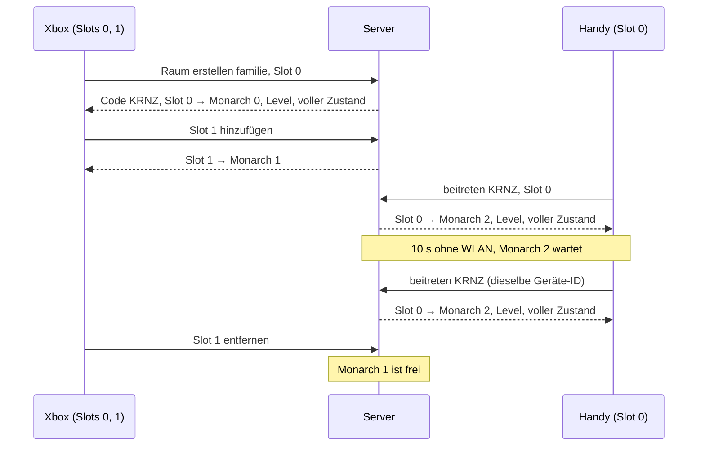

# Protokoll v2

Stand: 2026-09-30 · Sprint SP02 · [Entscheidung 002](decisions/002-protokoll-v2.md) · Zielbild: [Entscheidung 001](decisions/001-server-engine-go.md)

## Überblick

Der Go-Server rechnet alle Spiele. Jedes Spiel läuft in einem **Raum**. Browser sind reine Clients: Sie schicken die
Eingaben ihrer lokalen Spieler und zeichnen, was der Server schickt. Ein Gerät kann mehrere lokale Spieler haben
(Couch-Koop an der Xbox), mehrere Geräte teilen sich einen Raum (Online-Koop im Heimnetz), und mehrere Räume laufen
gleichzeitig.

Dieses Dokument legt das Raummodell fest. Es setzt die Beschlüsse von 🧑 vom 2026-09-30 um (Sprint-README SP02 ›
Regeln, Nummern 1–4 unten in Klammern). Protokoll v1 (`src/online/`) läuft unverändert weiter, bis SP07/SP08 v2 umsetzen.

## Begriffe

| Begriff | Bedeutung |
|---|---|
| **Raum** | Ein laufendes Spiel: eine Welt (Kampagne mit allen Stufen), ein Spielstand, ein Code. Tickt unabhängig von anderen Räumen. |
| **Code** | Kurze Kennung eines Raums: 4 Großbuchstaben ohne `I` und `O` (z. B. `KRNZ`). Vergibt der Server beim Erstellen, eindeutig solange der Raum lebt. |
| **Gerät** | Ein Browser mit Verbindung zum Server. Hat eine dauerhafte **Geräte-ID** (zufällig erzeugt, im `localStorage` gespeichert, deshalb gleich für alle Tabs desselben Browsers), damit es sich nach einem Abbruch wiedererkennen lässt. |
| **lokaler Spieler** | Ein Spieler an einem Gerät mit eigener Eingabe (Controller, Tastatur, Touch). Heißt auf dem Gerät **Slot** 0–3. |
| **Monarch** | Die Figur eines Spielers in der Welt, Index 0–3. Ein Monarch ist **besetzt** (gehört genau einem Paar Gerät + Slot), **wartend** (sein Gerät ist abgebrochen, höchstens 60 s) oder **frei**. |
| **Spielstand** | Gespeicherter Zustand einer Kampagne unter einem Namen (heute `saves/<name>.json`). Ein Raum ist genau ein Spielstand. |

Ein wartender oder freier Monarch bleibt in der Welt stehen und behält Münzen und Besitz. Er bewegt sich nicht.
Für den **Stufenwechsel** zählen nur besetzte Monarchen: Stehen alle besetzten am Ausgang, reisen freie und wartende
mit (Entscheidung 🧑 2026-09-30, Umsetzung B-059).

## Raumliste und Code

(Beschluss 1) Der Server liefert jedem verbundenen Gerät eine **Raumliste**, im Heimnetz ist nichts geheim.
Je Raum: Code, Name, Stufe, besetzte und freie Plätze, ob er gerade läuft oder pausiert. Die Liste ändert sich,
wenn ein Raum entsteht, verschwindet oder ein Platz sich ändert; Geräte ohne Raum bekommen die neue Liste geschickt.

Zusätzlich kann ein Gerät einem Raum **direkt per Code** beitreten, z. B. über einen Link mit dem Code in der URL
(Parameter legt SP08 fest). Der **Name** eines Raums ist der Name seines Spielstands.

## Beitreten

**Raum erstellen:** Jedes Gerät darf einen Raum erstellen. Es wählt einen neuen Spielstand (Name, Startstufe) oder
einen gespeicherten. Der Name passt zu `^[a-z0-9-]{1,32}$` (wie heute `server/saves.mjs`). Der Server prüft in dieser
Reihenfolge und hört beim ersten Treffer auf:

1. Ein Slot 4 oder höher → `too_many_slots`; sonst ungültige Nachricht, Name oder Slots → `bad_request`.
2. Der Spielstand ist schon in einem Raum offen: bei *gespeichert* wird diesem Raum beigetreten (ein Spielstand läuft
   nie doppelt), bei *neu* `save_exists`.
3. *Neu*, aber unter dem Namen liegt schon ein Spielstand → `save_exists`. *Gespeichert*, aber es gibt keinen →
   `save_not_found`.
4. Es sind schon 4 Räume offen → `too_many_rooms`.
5. Der Server erstellt den Raum, vergibt den Code und schickt ihn mit.

**Raum beitreten** (aus der Liste oder per Code):

1. Das Gerät nennt Geräte-ID, Code und die Slots seiner lokalen Spieler (mindestens einer).
2. Der Server prüft die Grenzen (siehe *Grenzen*). Passt es nicht, antwortet er mit einem Fehler und nimmt keinen
   Slot auf (alles oder nichts).
3. Jeder Slot bekommt einen Monarchen: zuerst einen freien, dabei bevorzugt den, den dasselbe Gerät mit demselben
   Slot zuletzt hatte, sonst den mit dem kleinsten Index; gibt es keinen freien, entsteht ein neuer.
4. Der Server schickt die Zuordnung Slot → Monarch, das Level und einen vollen Zustand. Danach laufende Zustände.

Ein Raum ohne verbundenes Gerät ist **pausiert**: Die Welt tickt nicht. Sobald ein Gerät beitritt, läuft sie weiter.

## Lokale Spieler hinzufügen/entfernen

Ein Gerät im Raum kann jederzeit einen Slot **hinzufügen** (z. B. zweiter Controller drückt A). Der Slot bekommt einen
Monarchen nach Schritt 3 oben, sofern die Grenzen es erlauben. Einen Slot **entfernen** macht dessen Monarchen sofort
frei; die anderen Slots desselben Geräts bleiben unberührt. Entfernt ein Gerät seinen letzten Slot, verlässt es den
Raum (siehe unten).

## Verlassen und Abbruch

- **Verlassen** (bewusst, z. B. Home-Button): Alle Monarchen des Geräts werden **sofort frei**.
- **Abbruch** (Verbindung weg, ohne Abmeldung): (Beschluss 3) Die Monarchen des Geräts werden **wartend** und stehen
  still. Nach **60 s** ohne Rückkehr werden sie frei.
- Ist danach kein Gerät mehr verbunden, ist der Raum pausiert und leer. Der Raum speichert sofort (siehe
  *Spielstand*). Bleibt er **10 min** leer, speichert er erneut und wird aufgeräumt; sein Code wird frei.

Beide Fristen (60 s, 10 min) laufen nach der Wanduhr des Servers, auch während der Raum pausiert ist.

## Wiederverbinden

(Beschluss 3) Ein Gerät, das nach einem Abbruch mit derselben Geräte-ID und demselben Code zurückkommt:

- **binnen 60 s:** Jeder genannte Slot bekommt den Monarchen zurück, den (Gerät, Slot) zuletzt hatte, und steuert
  weiter. Monarchen von Slots, die das Gerät nicht mehr nennt, werden sofort frei; zusätzliche Slots werden wie beim
  Hinzufügen behandelt. Der Server schickt Zuordnung, Level und einen vollen Zustand wie beim Beitreten.
- **nach 60 s:** Seine Plätze sind frei. Es tritt ganz normal neu bei. Weil beim Beitreten der Monarch bevorzugt wird,
  den (Gerät, Slot) zuletzt hatte, bekommt es seine alten Monarchen zurück, sofern kein anderes Gerät sie inzwischen
  übernommen hat.
- **nach dem Aufräumen:** Der Code ist unbekannt (Fehler). Der Spielstand ist gespeichert, das Gerät kann ihn über
  *Raum erstellen* wieder öffnen.

Tritt eine Geräte-ID einem Raum bei, in dem sie noch als verbunden gilt (z. B. zweiter Tab im selben Browser oder die
alte Verbindung ist noch nicht als abgebrochen erkannt), ersetzt die neue Verbindung die alte: Die alte bekommt den
Fehler `replaced` und wird geschlossen. Ein Gerät, das `replaced` bekommt, verbindet sich **nicht** automatisch neu,
sonst verdrängen sich zwei Tabs gegenseitig.

## Grenzen

(Beschluss 2) Der Server setzt durch:

| Grenze | Wert | Folge |
|---|---|---|
| Monarchen pro Raum | 4 | Ein Raum hat höchstens 4 Monarchen (besetzt, wartend oder frei) und damit höchstens 4 Geräte. |
| lokale Spieler pro Gerät | 4 | Slots 0–3. |
| Räume pro Server | 4 | Ein fünfter Raum wird nicht erstellt. |

Die Grenzen passen zum Raspberry Pi (SP11) und zur Snapshot-Schätzung für 4 Spieler (SP02.2). Heute (v1) sind es
8 Spieler pro Raum und keine Raum-Grenze.

## Spielstand

(Beschluss 4) Ein Raum ist genau ein Spielstand, ein Spielstand ist höchstens in einem Raum offen. Der Raum speichert
selbst, ohne Zutun der Geräte:

- bei jedem Stufenwechsel (Tiefen-Eingang, Treppe),
- sobald kein Gerät mehr verbunden ist,
- beim Aufräumen nach 10 min Leere,
- beim geordneten Beenden des Servers.

Ein Spielstand speichert die Welt, nicht die Monarchen und nicht die Zuordnung zu Geräten. Ein geöffneter Stand hat
zunächst **keinen** Monarchen; jeder entsteht beim Beitreten (Schritt 3). Gold gilt pro Index: Monarch n startet mit
dem gespeicherten Gold von Index n (wie heute `players[].gold` in `src/world/sim/campaign.ts`).

## Beispiel: 2 Controller an der Xbox + 1 Handy

1. Die Xbox (Gerät X) zeigt die Raumliste (leer) und erstellt einen Raum mit neuem Spielstand `familie`. Der Server
   vergibt Code `KRNZ`. Slot 0 (Controller 1) bekommt Monarch 0.
2. Controller 2 an der Xbox drückt A: X fügt Slot 1 hinzu → Monarch 1. Die Xbox zeigt Split-Screen.
3. Das Handy (Gerät H) sieht `KRNZ` `familie` mit 2 besetzten Plätzen in der Liste (oder öffnet den Link mit dem Code)
   und tritt mit Slot 0 bei → Monarch 2.
4. Das Handy verliert 10 s WLAN: Monarch 2 wird wartend und steht still, Xbox spielt weiter. H verbindet sich mit
   derselben Geräte-ID neu, bekommt Monarch 2 zurück und einen vollen Zustand.
5. Controller 2 verlässt das Spiel: X entfernt Slot 1, Monarch 1 wird frei und bleibt stehen. Slot 0 der Xbox und das
   Handy spielen weiter. Ein weiteres Gerät könnte jetzt beitreten und bekäme Monarch 1.

## Fehlerfälle

| Situation | Verhalten |
|---|---|
| Raum hat schon 4 Monarchen, keiner frei, Gerät will beitreten oder einen Slot hinzufügen | Fehler „Raum ist voll“, nichts wird aufgenommen; beim Beitreten bleibt das Gerät bei der Raumliste. |
| Gerät will einen 5. lokalen Spieler | Fehler „zu viele Spieler an diesem Gerät“, die bisherigen Slots bleiben. |
| Gerät will einen 5. Raum erstellen | Fehler „zu viele Räume“, das Gerät bleibt bei der Raumliste. |
| Unbekannter Code (nie vergeben oder aufgeräumt) | Fehler „Raum nicht gefunden“, das Gerät bleibt bei der Raumliste. |
| Neuer Spielstand unter einem Namen, den es schon gibt (gespeichert oder in einem Raum offen) | Fehler „Spielstand gibt es schon“, das Gerät bleibt bei der Raumliste. |
| Gespeicherter Spielstand, den es nicht gibt | Fehler „Spielstand nicht gefunden“, das Gerät bleibt bei der Raumliste. |
| Raum stürzt ab oder der Server fährt herunter | Fehler „Raum ist geschlossen“ an alle Geräte im Raum; sie gehen zurück zur Raumliste (beim Herunterfahren schließt der Server danach die Verbindung). |
| Dieselbe Geräte-ID tritt demselben Raum über eine neue Verbindung bei | Die alte Verbindung bekommt „an anderer Stelle geöffnet“ und wird geschlossen, kein automatisches Neuverbinden (siehe *Wiederverbinden*). |
| Gerät kommt nach mehr als 60 s zurück | Kein Fehler: normales Beitreten, freie Monarchen desselben Geräts zuerst (siehe *Wiederverbinden*). |
| Falsche Protokoll-Version oder erste Nachricht ist kein gültiges `hello` | Fehler „veraltete Version, Seite neu laden“, der Server schließt die Verbindung. |

Fehler beenden nie einen Raum und betreffen nie andere Räume; außer `room_closed` betreffen sie nur das eine Gerät.

## Nachrichten

**Transport:** JSON-Texte über WebSocket unter `/ws`, eine Nachricht pro Frame, Feld `t` = Typ. WebSocket liefert
vollständig und in Reihenfolge, deshalb braucht es keine Wiederholung und keine Lückenerkennung.

**Version:** Das Feld `v` steht nur im Handschlag (`hello`, `welcome`), nicht in jeder Nachricht. Die Version gilt für
die ganze Verbindung; jede weitere Nachricht damit auszustatten kostet bei 30 Snapshots pro Sekunde nur Bytes.
Erste Nachricht nach dem Verbinden ist immer `hello`. Ist sie kein gültiges `hello` (kein JSON, anderer Typ, Feld
fehlt, `v` nicht 2), antwortet der Server mit `version` und schließt: Ein alter v1-Client schickt zuerst `join`.

**Takt:** Ein laufender Raum tickt mit **30 Hz** und schickt jedem seiner Geräte pro Tick genau einen Zustand
(`snap` oder `delta`). Ein pausierter Raum schickt nichts. Geräte schicken `input`, sobald sich die Eingabe eines Slots
ändert, und sonst mindestens alle 500 ms zur Bestätigung; höchstens eine `input` pro Tick. Der Server rechnet mit der
zuletzt empfangenen Eingabe. Hinweis für SP07: Kommt ein Gerät mit dem Lesen nicht nach (Sendepuffer voll), schließt
der Server die Verbindung; das zählt als Abbruch.

| Nachricht | Richtung | Wann | Felder | Beispiel |
|---|---|---|---|---|
| `hello` | Gerät → Server | als erste Nachricht | `v` Protokoll-Version (2), `device` Geräte-ID (≤ 64 Zeichen) | `c2s-hello.json` |
| `welcome` | Server → Gerät | Antwort auf passendes `hello` | `v`, `tickHz`, `limits` (Grenzen aus *Grenzen*) | `s2c-welcome.json` |
| `rooms` | Server → Gerät | nach `welcome`, sobald das Gerät wieder in keinem Raum ist, und bei jeder Änderung, solange es in keinem Raum ist | `rooms[]`: `code`, `name`, `depth`, `taken` (besetzt + wartend), `free` (4 − `taken`), `running` | `s2c-rooms.json` |
| `create` | Gerät → Server | Raum erstellen | `save` Name des Spielstands (`^[a-z0-9-]{1,32}$`), `fresh` neu (true) oder gespeicherten laden, `depth` Startstufe (nur bei `fresh`), `slots[]` | `c2s-create.json` |
| `join` | Gerät → Server | Raum beitreten oder wiederverbinden | `room` Code, `slots[]` | `c2s-join.json` |
| `joined` | Server → Gerät | nach erfolgreichem `create`/`join` | `room`, `name`, `you[]`: `slot` → `monarch` | `s2c-joined.json` |
| `level` | Server → Gerät | nach `joined` und nach jedem Stufenwechsel, vor dem ersten Zustand der Stufe | `depth`, `layout` (Level: Biom-ID, Breite, Chunks, Objekte) | `s2c-level.json` |
| `snap` | Server → Gerät | voller Zustand: nach `level` (Beitreten, Wiederverbinden, Stufenwechsel) | `tick`, `ack`, `s` (Zustand der Welt ohne Statisches, mit `events` und `depth`) | `s2c-snapshot-full.json` |
| `delta` | Server → Gerät | jeder weitere Tick | `tick`, `ack`, `s` (nur Änderungen zum vorigen Tick) | `s2c-snapshot-delta.json` |
| `seats` | Server → alle Geräte im Raum | wenn sich eine Zuordnung oder ein Monarch-Zustand ändert | `you[]` (eigene Slots), `monarchs[]` je Index `taken`/`waiting`/`free` | `s2c-seats.json` |
| `addSlot` | Gerät → Server | lokaler Spieler kommt dazu | `slot` 0–3 | `c2s-add-slot.json` |
| `removeSlot` | Gerät → Server | lokaler Spieler geht | `slot` | `c2s-remove-slot.json` |
| `input` | Gerät → Server | Eingabe hat sich geändert, sonst mindestens alle 500 ms, höchstens eine pro Tick | `seq` fortlaufend je Verbindung, `p[]`: `slot`, `moveX` (−1…1), `sprint`, `pay` | `c2s-input.json` |
| `leave` | Gerät → Server | Raum bewusst verlassen | – | `c2s-leave.json` |
| `error` | Server → Gerät | Fehlerfall, siehe Codes | `code`, `message` (deutsch, für die Anzeige) | `s2c-error.json` |

Die Beispiele stammen aus dem Ablauf *2 Controller an der Xbox + 1 Handy*; `level`, `snap` und `delta` sind aus der
heutigen TS-Simulation erzeugt (Seed `familie`, 3 Spieler, Tick 299/300). **Außerhalb des Ablaufs:** der zweite Raum
`BWTQ` in `s2c-rooms.json` (zeigt einen pausierten Raum) und `s2c-error.json` (`room_full` kommt im Ablauf nicht vor).

**Zustand und Delta:** `s` in `snap` hat die Felder der Welt ohne `seed`, `biome`, `level`, `rng`, `widthUnits`
(wie v1), dazu `events` des Ticks (leer: `[]`) und `depth`, die Stufe des Zustands (gleich `level.depth`).
`delta` enthält nur geänderte Felder; ein Feld, das fehlt, ist unverändert. Listen mit `id` (`players`, `coins`,
`troops`, `nodes`, `sites`, `enemies`, `projectiles`, `pickups`) stehen als `{ "set": [geänderte oder neue Einträge],
"del": [entfernte ids] }`. Alles ohne `id` (einfache Werte, Objekte wie `cycle`, `castle`, `stock`, `travel`, Listen
wie `camps`, `portals`, `spawnQueue`) steht bei einer Änderung ganz darin. `null` ist ein Wert (z. B. `travel` endet),
kein Löschen. Fehlt `events`, gab es im Tick keine. `seq` zählt je Verbindung ab 1, nach einem Wiederverbinden also
neu. `ack` ist das höchste `seq`, das der Server von **dieser** Verbindung verrechnet hat (Grundlage für eine spätere
Vorhersage, B-039).

**Level-Übertragung:** Ab SP09 hat der Browser keinen Level-Generator mehr. Deshalb schickt der Server das Level
(`level`) statt nur den Seed. Biom-Werte (Farben, Namen) liest der Client aus `data/` über die Biom-ID.

### Fehler-Codes

| Code | Situation (siehe *Fehlerfälle*) | Verbindung |
|---|---|---|
| `room_full` | Raum hat 4 Monarchen, keiner frei | bleibt |
| `too_many_slots` | 5. lokaler Spieler (Slot 4 oder höher bei `create`, `join`, `addSlot`) | bleibt |
| `too_many_rooms` | 5. Raum | bleibt |
| `room_not_found` | unbekannter Code | bleibt |
| `save_exists` | `create` mit `fresh: true` und einem Namen, den es schon gibt | bleibt |
| `save_not_found` | `create` mit `fresh: false` und einem Namen, den es nicht gibt | bleibt |
| `room_closed` | Raum abgestürzt oder Server fährt herunter; Gerät geht zurück zur Raumliste | bleibt (beim Herunterfahren: Server schließt) |
| `replaced` | dieselbe Geräte-ID ist demselben Raum über eine neue Verbindung beigetreten | Server schließt, kein automatisches Neuverbinden |
| `version` | erste Nachricht ist kein gültiges `hello` oder `v` ist nicht 2 | Server schließt |
| `bad_request` | kein gültiges JSON, unbekannter Typ, Feld fehlt, Name passt nicht zum Format, ungültiger Slot (doppelt, keine Zahl 0–3, bei `input`/`removeSlot` nicht vom Gerät, bei `addSlot` schon vergeben), Nachricht passt nicht zum Zustand (`input`, `addSlot`, `removeSlot`, `leave` ohne Raum; `create`, `join` im Raum) | bleibt, Nachricht wird verworfen |

`bad_request` ist kein Fehlerfall aus dem Raummodell, sondern Schutz vor kaputten Clients. Die Rückkehr nach 60 s ist
kein Fehler und hat keinen Code.

### Snapshot-Größe

**Messweg:** Wegwerf-Skript (nicht eingecheckt) mit der heutigen TS-Simulation: `createCampaign` mit 4× `joinPlayer`,
Stufe 0 (Wald) und Stufe 1 (Höhle), `cycleSpeed` 8, 5400 Ticks mit `step(…, 1/30)` (3 min, mehrere Tage und Nächte),
wechselnde Eingaben. Je Tick `JSON.stringify` des vollen Zustands und eines Deltas nach der Regel oben.
1 KB = 1000 Byte, 1 MB = 1000 KB.

| 4 Spieler | Stufe 0 | Stufe 1 |
|---|---|---|
| `level` | 3,0 KB | 1,6 KB |
| `snap` (voll) Mittel / Max | 10,7 KB / 13,0 KB | 6,0 KB / 7,8 KB |
| `delta` Mittel / Max | 2,0 KB / 4,0 KB | 1,7 KB / 3,2 KB |

**Bei 30 Hz pro Gerät:** nur `snap` ≈ 320 KB/s (≈ 2,6 Mbit/s), mit `delta` ≈ 61 KB/s (≈ 0,5 Mbit/s), Spitzen
≈ 120 KB/s. Ein Raum mit 4 Geräten sendet mit `delta` ≈ 0,25 MB/s. Für WLAN im Heimnetz reicht JSON mit `delta`; ein
Binärformat ist nicht nötig. Das Delta wird von vielen Nachkommastellen (`x`, `time`) und ganzen geänderten
Einträgen bestimmt; Runden auf 2 Stellen wäre die nächste Stellschraube, falls die Messung am Pi (SP11) es verlangt.
