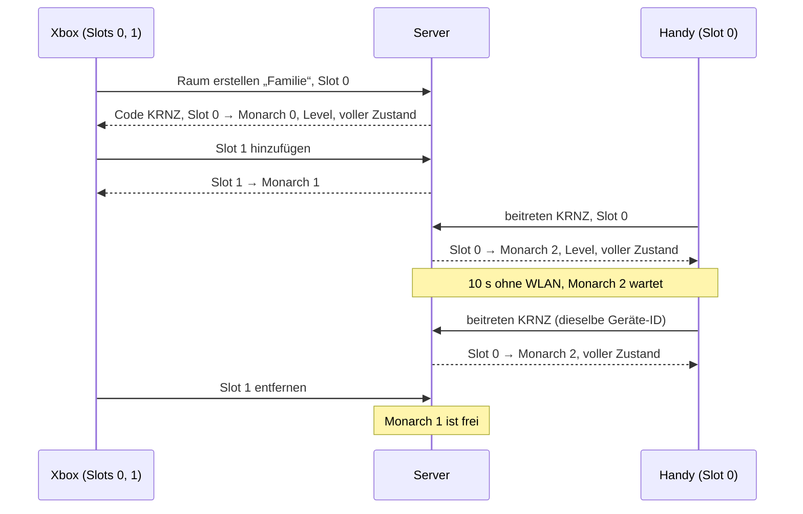

# Protokoll v2

Stand: 2026-09-30 · Sprint SP02 · Entscheidung 002 (folgt in SP02.3) · Zielbild: [Entscheidung 001](decisions/001-server-engine-go.md)

## Überblick

Der Go-Server rechnet alle Spiele. Jedes Spiel läuft in einem **Raum**. Browser sind reine Clients: Sie schicken die
Eingaben ihrer lokalen Spieler und zeichnen, was der Server schickt. Ein Gerät kann mehrere lokale Spieler haben
(Couch-Koop an der Xbox), mehrere Geräte teilen sich einen Raum (Online-Koop im Heimnetz), und mehrere Räume laufen
gleichzeitig.

Dieses Dokument legt das Raummodell fest. Es setzt die Beschlüsse von 🧑 vom 2026-09-30 um (Sprint-README SP02 ›
Regeln, Nummern 1–4 unten in Klammern). Protokoll v1 (`src/online/`) läuft unverändert weiter, bis SP07/SP08 v2 umsetzen.

## Begriffe

| Begriff | Bedeutung |
|---|---|
| **Raum** | Ein laufendes Spiel: eine Welt (Kampagne mit allen Stufen), ein Spielstand, ein Code. Tickt unabhängig von anderen Räumen. |
| **Code** | Kurze Kennung eines Raums: 4 Großbuchstaben ohne `I` und `O` (z. B. `KRNZ`). Vergibt der Server beim Erstellen, eindeutig solange der Raum lebt. |
| **Gerät** | Ein Browser-Tab mit Verbindung zum Server. Hat eine dauerhafte **Geräte-ID** (zufällig erzeugt, im `localStorage` gespeichert), damit es sich nach einem Abbruch wiedererkennen lässt. |
| **lokaler Spieler** | Ein Spieler an einem Gerät mit eigener Eingabe (Controller, Tastatur, Touch). Heißt auf dem Gerät **Slot** 0–3. |
| **Monarch** | Die Figur eines Spielers in der Welt, Index 0–3. Ein Monarch ist **besetzt** (gehört genau einem Paar Gerät + Slot), **wartend** (sein Gerät ist abgebrochen, höchstens 60 s) oder **frei**. |
| **Spielstand** | Gespeicherter Zustand einer Kampagne unter einem Namen (heute `saves/<slot>.json`). Ein Raum ist genau ein Spielstand. |

Ein wartender oder freier Monarch bleibt in der Welt stehen und behält Münzen und Besitz. Er bewegt sich nicht.

## Raumliste und Code

(Beschluss 1) Der Server liefert jedem verbundenen Gerät eine **Raumliste**, im Heimnetz ist nichts geheim.
Je Raum: Code, Name, Stufe, besetzte und freie Plätze, ob er gerade läuft oder pausiert. Die Liste ändert sich,
wenn ein Raum entsteht, verschwindet oder ein Platz sich ändert; Geräte ohne Raum bekommen die neue Liste geschickt.

Zusätzlich kann ein Gerät einem Raum **direkt per Code** beitreten, z. B. über einen Link mit dem Code in der URL
(Parameter legt SP08 fest). Der **Name** eines Raums ist der Name seines Spielstands.

## Beitreten

**Raum erstellen:** Jedes Gerät darf einen Raum erstellen. Es wählt einen neuen Spielstand (Name, Startstufe) oder
einen gespeicherten. Ist der gewählte Spielstand schon in einem Raum offen, wird **nicht** neu erstellt, sondern
diesem Raum beigetreten (ein Spielstand läuft nie doppelt). Der Server vergibt den Code und schickt ihn mit.

**Raum beitreten** (aus der Liste oder per Code):

1. Das Gerät nennt Geräte-ID, Code und die Slots seiner lokalen Spieler (mindestens einer).
2. Der Server prüft die Grenzen (siehe *Grenzen*). Passt es nicht, antwortet er mit einem Fehler und nimmt keinen
   Slot auf (alles oder nichts).
3. Jeder Slot bekommt einen Monarchen: zuerst einen freien, dabei bevorzugt einen, den dasselbe Gerät früher besetzt
   hat, sonst den mit dem kleinsten Index; gibt es keinen freien, entsteht ein neuer.
4. Der Server schickt die Zuordnung Slot → Monarch, das Level und einen vollen Zustand. Danach laufende Zustände.

Ein Raum ohne verbundenes Gerät ist **pausiert**: Die Welt tickt nicht. Sobald ein Gerät beitritt, läuft sie weiter.

## Lokale Spieler hinzufügen/entfernen

Ein Gerät im Raum kann jederzeit einen Slot **hinzufügen** (z. B. zweiter Controller drückt A). Der Slot bekommt einen
Monarchen nach Schritt 3 oben, sofern die Grenzen es erlauben. Einen Slot **entfernen** macht dessen Monarchen sofort
frei; die anderen Slots desselben Geräts bleiben unberührt. Entfernt ein Gerät seinen letzten Slot, verlässt es den
Raum (siehe unten).

## Verlassen und Abbruch

- **Verlassen** (bewusst, z. B. Home-Button): Alle Monarchen des Geräts werden **sofort frei**.
- **Abbruch** (Verbindung weg, ohne Abmeldung): (Beschluss 3) Die Monarchen des Geräts werden **wartend** und stehen
  still. Nach **60 s** ohne Rückkehr werden sie frei.
- Ist danach kein Gerät mehr verbunden, ist der Raum pausiert und leer. Der Raum speichert sofort (siehe
  *Spielstand*). Bleibt er **10 min** leer, speichert er erneut und wird aufgeräumt; sein Code wird frei.

## Wiederverbinden

(Beschluss 3) Ein Gerät, das nach einem Abbruch mit derselben Geräte-ID und demselben Code zurückkommt:

- **binnen 60 s:** bekommt dieselben Slots mit denselben Monarchen zurück und steuert weiter. Der Server schickt
  Zuordnung, Level und einen vollen Zustand wie beim Beitreten.
- **nach 60 s:** Seine Plätze sind frei. Es tritt ganz normal neu bei. Weil freie Monarchen desselben Geräts
  bevorzugt werden, bekommt es seine alten Monarchen zurück, sofern kein anderes Gerät sie inzwischen übernommen hat.
- **nach dem Aufräumen:** Der Code ist unbekannt (Fehler). Der Spielstand ist gespeichert, das Gerät kann ihn über
  *Raum erstellen* wieder öffnen.

Meldet sich eine Geräte-ID an, die im Raum noch als verbunden gilt (z. B. zweiter Tab im selben Browser oder die alte
Verbindung ist noch nicht als abgebrochen erkannt), ersetzt die neue Verbindung die alte. Die alte wird geschlossen.

## Grenzen

(Beschluss 2) Der Server setzt durch:

| Grenze | Wert | Folge |
|---|---|---|
| Monarchen pro Raum | 4 | Ein Raum hat höchstens 4 Monarchen (besetzt, wartend oder frei) und damit höchstens 4 Geräte. |
| lokale Spieler pro Gerät | 4 | Slots 0–3. |
| Räume pro Server | 4 | Ein fünfter Raum wird nicht erstellt. |

Die Grenzen passen zum Raspberry Pi (SP11) und zur Snapshot-Schätzung für 4 Spieler (SP02.2). Heute (v1) sind es
8 Spieler pro Raum und keine Raum-Grenze.

## Spielstand

(Beschluss 4) Ein Raum ist genau ein Spielstand, ein Spielstand ist höchstens in einem Raum offen. Der Raum speichert
selbst, ohne Zutun der Geräte:

- bei jedem Stufenwechsel (Tiefen-Eingang, Treppe),
- sobald kein Gerät mehr verbunden ist,
- beim Aufräumen nach 10 min Leere,
- beim geordneten Beenden des Servers.

Ein Spielstand speichert die Welt, nicht die Zuordnung zu Geräten. Wer einen gespeicherten Stand öffnet, findet alle
Monarchen frei vor und übernimmt sie beim Beitreten.

## Beispiel: 2 Controller an der Xbox + 1 Handy

1. Die Xbox (Gerät X) zeigt die Raumliste (leer) und erstellt einen Raum mit neuem Spielstand „Familie“. Der Server
   vergibt Code `KRNZ`. Slot 0 (Controller 1) bekommt Monarch 0.
2. Controller 2 an der Xbox drückt A: X fügt Slot 1 hinzu → Monarch 1. Die Xbox zeigt Split-Screen.
3. Das Handy (Gerät H) sieht `KRNZ` „Familie“ mit 2 besetzten Plätzen in der Liste (oder öffnet den Link mit dem Code)
   und tritt mit Slot 0 bei → Monarch 2.
4. Das Handy verliert 10 s WLAN: Monarch 2 wird wartend und steht still, Xbox spielt weiter. H verbindet sich mit
   derselben Geräte-ID neu, bekommt Monarch 2 zurück und einen vollen Zustand.
5. Controller 2 verlässt das Spiel: X entfernt Slot 1, Monarch 1 wird frei und bleibt stehen. Slot 0 der Xbox und das
   Handy spielen weiter. Ein weiteres Gerät könnte jetzt beitreten und bekäme Monarch 1.

## Fehlerfälle

| Situation | Verhalten |
|---|---|
| Raum hat schon 4 Monarchen, keiner frei, Gerät will beitreten oder einen Slot hinzufügen | Fehler „Raum ist voll“, nichts wird aufgenommen; beim Beitreten bleibt das Gerät bei der Raumliste. |
| Gerät will einen 5. lokalen Spieler | Fehler „zu viele Spieler an diesem Gerät“, die bisherigen Slots bleiben. |
| Gerät will einen 5. Raum erstellen | Fehler „zu viele Räume“, das Gerät bleibt bei der Raumliste. |
| Unbekannter Code (nie vergeben oder aufgeräumt) | Fehler „Raum nicht gefunden“, das Gerät bleibt bei der Raumliste. |
| Gerät kommt nach mehr als 60 s zurück | Kein Fehler: normales Beitreten, freie Monarchen desselben Geräts zuerst (siehe *Wiederverbinden*). |
| Falsche Protokoll-Version | Fehler „veraltete Version, Seite neu laden“, der Server schließt die Verbindung. Das Feld legt SP02.2 fest. |

Fehler beenden nie einen Raum und betreffen nie andere Geräte oder Räume.

## Nachrichten

Folgt in SP02.2: Nachrichten-Tabelle mit Versionsfeld, Eingaben pro Slot, vollem und Delta-Zustand, Level-Übertragung,
Raumliste, Fehler-Codes, Takt 30 Hz und JSON-Beispielen in `testdata/protocol/`.
